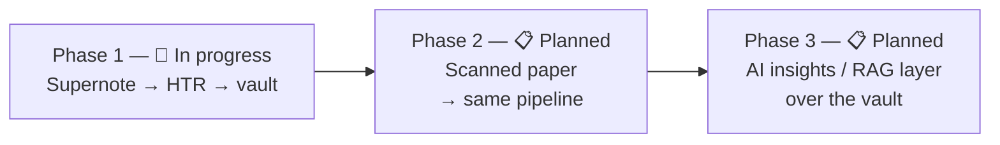
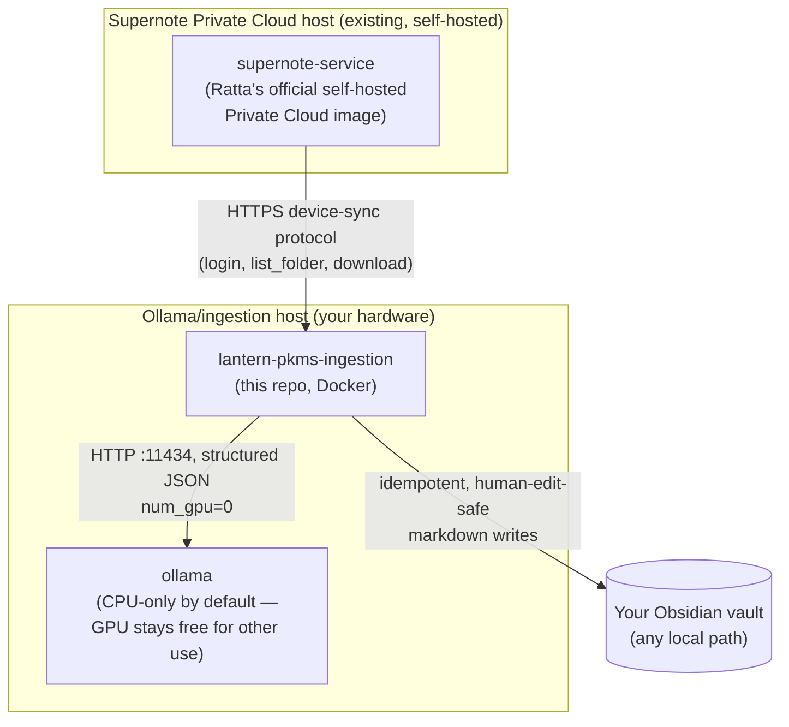
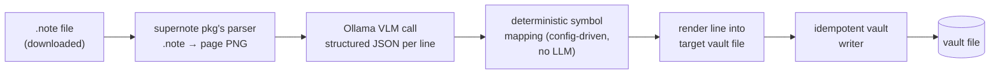

# lantern-pkms

Automated pipeline: handwritten bullet-journal pages on a self-hosted **Supernote
Private Cloud** → local handwriting transcription (HTR) via a vision-language model
on **Ollama** → structured markdown in an Obsidian vault.

Everything runs locally — no cloud AI, no data leaving your network. This is v1:
Supernote ingestion only. Scanned physical paper and an AI insights/RAG layer on top
of the vault are deliberately out of scope for now; the design avoids decisions that
would make those harder later (see Roadmap below).

Built for personal use but designed to be self-hostable by anyone with a Supernote
device, a self-hosted Supernote Private Cloud instance, Docker, and Ollama — nothing
about the pipeline itself assumes a specific network, hostnames, or folder
convention. See "Configuration" below.

## Why

Bullet journaling on paper (or e-ink) is great for the actual writing, terrible for
searching, cross-referencing, or building anything on top of later. This pipeline
makes the handwritten record a durable, plain-markdown, git-trackable one — while
preserving the ritual of writing by hand.

## Roadmap



| Phase | Status | Scope |
|---|---|---|
| **1. Supernote ingestion** | 🚧 This repo, in progress | Everything documented below — handwritten bullet journal pages → local HTR → your Obsidian vault. |
| **2. Scanned paper** | 📋 Planned, not started | A second source adapter for physical paper scanned via a document-management tool (e.g. Paperless-ngx), feeding the *same* `vault_entries`-shaped pipeline (state tracking, HTR, deterministic structuring, idempotent vault writes) rather than a separate system. |
| **3. AI insights / RAG** | 📋 Planned, not started | A layer that reads the vault (or `state.db`) to answer questions, surface patterns, and generate summaries — fully local, no cloud AI. Not started; no design decisions made yet beyond "don't paint ourselves into a corner." |

**Why this order:** phase 1 is the highest-leverage, most novel piece (HTR + the
ownership-handoff vault-writer logic) and phases 2-3 are explicitly designed to slot
in without a rewrite — not because they're less important. Phase 1's `vault_entries`
schema already carries `category`, `entry_date`, and `review_needed` in
machine-parseable frontmatter specifically so a future insights layer has a stable,
structured surface to build on, and phase 2 is scoped to reuse the identical
ingestion/writer pipeline with a different source adapter rather than becoming its
own system.

**Explicitly out of scope for phase 1** (don't scope-creep into these without a
deliberate decision to start the next phase): any scanned-document integration, any
vector search / embeddings / semantic index, any chat/Q&A interface, any
summarization of vault content.

## Architecture



### Per-page pipeline



## Configuration

Nothing about this setup is hardcoded — everything below is either an environment
variable or a YAML config file you can override.

**Environment variables** (`src/lantern_pkms/config.py`, `LANTERN_PKMS_` prefix):

| Variable | Meaning |
|---|---|
| `LANTERN_PKMS_OLLAMA_HOST` | Base URL of your Ollama instance |
| `LANTERN_PKMS_OLLAMA_MODEL` | Vision model tag to use for HTR |
| `LANTERN_PKMS_SUPERNOTE_CLOUD_URL` | Base URL of your self-hosted Supernote Private Cloud |
| `LANTERN_PKMS_SUPERNOTE_USERNAME` / `LANTERN_PKMS_SUPERNOTE_PASSWORD` | Your Supernote account credentials |
| `LANTERN_PKMS_VAULT_PATH` | Path to your Obsidian vault |
| `LANTERN_PKMS_STATE_DB_PATH` | Where to keep the SQLite state file |
| `LANTERN_PKMS_SYMBOL_MAPPING_PATH` | Path to your symbol-mapping config (see below) |
| `LANTERN_PKMS_TAXONOMY_CONFIG_PATH` | Path to your folder-taxonomy config (see below) |
| `LANTERN_PKMS_POLL_INTERVAL_MINUTES` | How often to sync (default: nightly) |
| `LANTERN_PKMS_METRICS_PORT` | Prometheus `/metrics` port |

**`config/symbol-mapping.default.yml`** — your bullet-journal symbol semantics
(which mark means task/event/note/mood, what "crossed out" vs. "struck through"
mean). See "Bullet-journal symbol semantics" below.

**`config/taxonomy.default.yml`** — maps *your* Supernote folder structure to *your*
vault structure. Nothing requires you to use "Daily/Monthly/Future/Collections/Other"
— rename categories, change folder names, adjust date formats, all without touching
code. See the comments in that file for the full schema; `tests/test_taxonomy.py`'s
`test_custom_taxonomy_config_is_fully_driven_by_config` demonstrates a completely
different convention working with zero code changes.

Copy either default file, edit it, and point the corresponding env var at your copy.

## Bullet-journal symbol semantics

Configurable, not hardcoded — see `config/symbol-mapping.default.yml`. Default
mapping (tune as your own convention evolves):

| Symbol | Meaning | Notes |
|---|---|---|
| `•` bullet | Task | crossed-out → complete |
| `○` circle | Event | |
| `–` dash | Note | |
| `=` equals | Mood/emotion | |
| `<` left chevron | Task deferred to backlog | renders in place with its literal mark — moving it is manual, not automatic |
| `>` right chevron | Task pushed to next day | renders in place with its literal mark — moving it is manual, not automatic |
| struck-through text | Cancelled | any entry type |

The vision model only reports *what it sees* (raw symbol, crossed-out, struck-through,
confidence) — deciding what a symbol *means* is a separate, deterministic, config-driven
pass (`structuring/symbol_mapping.py`), never an LLM judgment call.

## Human-edit safety

You can freely edit, annotate, and link ingested notes in Obsidian. The vault writer
(`vault/writer.py`) works at whole-file granularity — a note is either fully
system-owned or fully yours, never a line-by-line mix:

- **Untouched notes are freely regenerated.** As long as a note is still exactly
  what the system last wrote (ignoring only its own `last_synced` timestamp), every
  sync blows it away and fully recreates it from everything transcribed for it so
  far — safe, since nothing you've written has been added yet.
- **The moment you touch a note, it's frozen forever.** Fix a typo, toggle a
  checkbox, add a `[[wikilink]]`, write a paragraph of your own — any of that
  permanently hands the file over to you. Later re-ingestion never writes to it
  again.
- **New content forks instead of overwriting.** When a frozen note needs new
  synced content, it lands in a new file (e.g. `Backlog (cont. 1).md`) that links
  back to the note it forked from, with a matching backlink written once into the
  old note. Your original note keeps its path forever, so links you've already made
  into it never break. Notes that accumulate over a long time (Backlog, Future Log,
  Monthly collections) can grow into a chain this way — each edit adds one more
  link, and only the current tip keeps receiving new entries.
- **Files are found by content, not a trusted path** — renaming an untouched note
  in Obsidian doesn't break tracking (frontmatter under a namespaced `lantern_pkms:`
  key is what's actually matched on).

## Repo layout

```
config/
├── symbol-mapping.default.yml   # tunable symbol → meaning mapping
└── taxonomy.default.yml          # tunable Supernote folder <-> vault folder mapping
src/lantern_pkms/
├── main.py                # scheduler loop + orchestration
├── config.py               # env-var settings (pydantic-settings)
├── taxonomy.py              # config-driven category/path mapping
├── supernote/
│   ├── client.py            # hand-rolled client for the device-sync protocol
│   └── note_parser.py       # wraps the `supernote` pkg's .note parser
├── htr/                     # Ollama structured-output HTR client
├── structuring/              # symbol_mapping.py — deterministic
├── vault/writer.py           # idempotent, human-edit-safe vault writer
├── state/db.py               # SQLite: notes/pages/targets/vault_entries tracking
└── metrics.py                 # Prometheus metrics
scripts/htr_bench.py          # standalone Phase-0 verification CLI
tests/                         # 107 tests, run with `pytest`
SECURITY-REVIEW.md             # dependency/image risk review — required before use
```

## Status

**Fully built and tested (107/107 passing):** structuring logic, state tracking, the
vault writer's whole-file recreate/fork guarantees, the configurable taxonomy system,
the Supernote client, the Ollama HTR client, and end-to-end orchestration.

**Live-verified against a real self-hosted Supernote instance:** login (including
with MFA enabled — the device/terminal login path bypasses it, same as the physical
tablet) and folder listing. See `SupernoteClient.login()`'s docstring for a genuinely
load-bearing implementation detail found the hard way — don't touch the `timestamp`
handling without reading it first.

**Infrastructure deploys cleanly:** on a real reference host, Docker and Ollama
(image pulled, container running) both deploy successfully via the example Ansible
roles. The only remaining deploy step is cloning this repo itself at a pinned tag —
waiting on this repo's first real release.

**Not yet done:** end-to-end HTR transcription quality hasn't been evaluated against
real handwriting yet (`scripts/htr_bench.py transcribe`), and this repo hasn't been
tagged/released yet.

## Development

```bash
python3 -m venv .venv && .venv/bin/pip install -e ".[dev]"
.venv/bin/pytest                          # run the test suite

# Phase 0 verification against your real account (see scripts/htr_bench.py
# docstring for full usage — needs SUPERNOTE_CLOUD_URL / SUPERNOTE_USERNAME /
# SUPERNOTE_PASSWORD / OLLAMA_HOST env vars):
.venv/bin/python scripts/htr_bench.py list
.venv/bin/python scripts/htr_bench.py transcribe --path "/NOTE/Note/Journal/Daily/2026/2026-07-09.note"
```

## Deployment

This is a standard containerized app — build the image and run it with your config:

```bash
docker build -t lantern-pkms .
docker run -d \
  -e LANTERN_PKMS_OLLAMA_HOST=http://your-ollama-host:11434 \
  -e LANTERN_PKMS_SUPERNOTE_CLOUD_URL=https://your-supernote-instance.example.com \
  -e LANTERN_PKMS_SUPERNOTE_USERNAME=you@example.com \
  -e LANTERN_PKMS_SUPERNOTE_PASSWORD=... \
  -e LANTERN_PKMS_VAULT_PATH=/vault \
  -v /path/to/your/obsidian/vault:/vault \
  -v lantern-pkms-data:/data \
  -v /path/to/your/config:/config \
  lantern-pkms
```

There's also an example production deployment via Ansible in a companion homelab
infrastructure repo (not included here, since it's specific to one person's
homelab) — see that repo's `roles/ollama/` and `roles/lantern_pkms_ingestion/` for a
reference of how the pieces fit together (OpenBao-backed secrets, systemd-adjacent
service management, Prometheus/Grafana telemetry, etc.) if you're deploying via
Ansible yourself.

## Security

Every new dependency and Docker image gets a documented risk review before use —
see `SECURITY-REVIEW.md`. This is a standing practice: re-review on every version bump,
not just at initial adoption.
